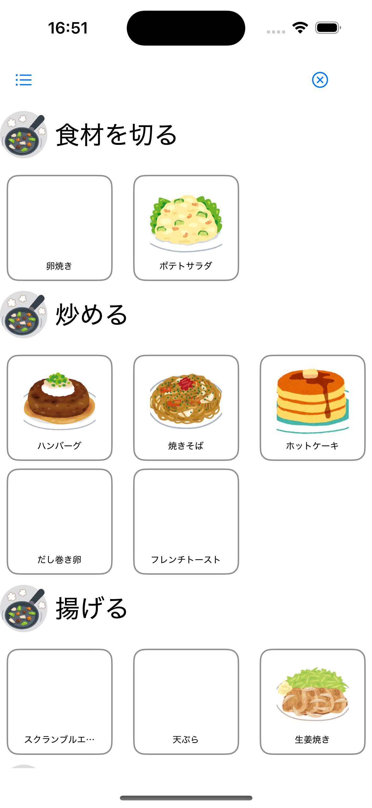
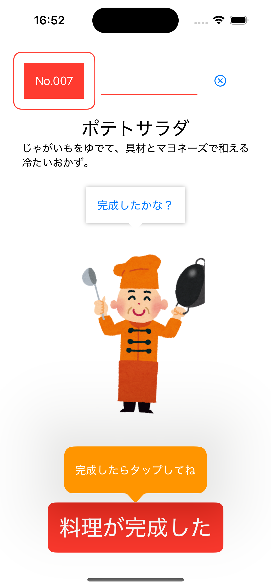
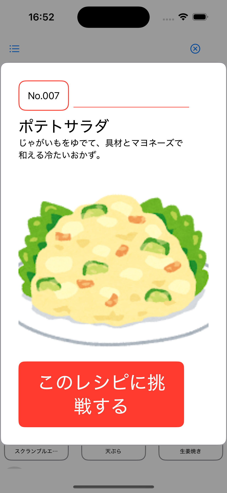
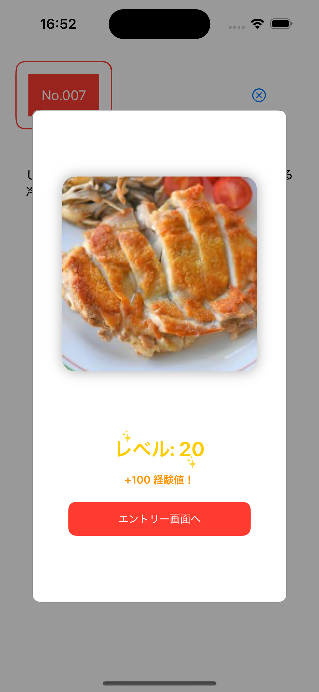

# 子どもの料理レベルアップサポートアプリ

## 📱 iOSアプリの紹介

本アプリでは、子どもが料理のレベルアップを実感できるサポートができる機能を用意しています。
一つのレシピを完成させるごとにユーザーのレベルや経験値が上がり、お料理のバッジ取得が出来たり、達成感を味わえるように作っていきます。

##  エントリー画面
子供がアプリを開いたときに最初に表示される画面です。
自分のレベルや経験値、次のレベルアップに向けて何をすればいいのか確認できます。
攻略おすすめのレシピが表示されるので、タップするとレシピ詳細画面に遷移します。

## カテゴリ別レシピ一覧画面

  

いくつかのカテゴリごとにレシピの一覧を表示させます。
タップするとレシピ詳細画面に遷移します。

## 🏫 レシピ詳細画面

  

レシピの詳細を見ながら、選択したレシピを作っていくための画面です。

## 🏫 レシピ名ポップアップ

  

レシピ名とレシピの概要・アイコンが閲覧できるポップアップ

##  完成時のポップアップ

  

完成したときに表示されるポップアップ

